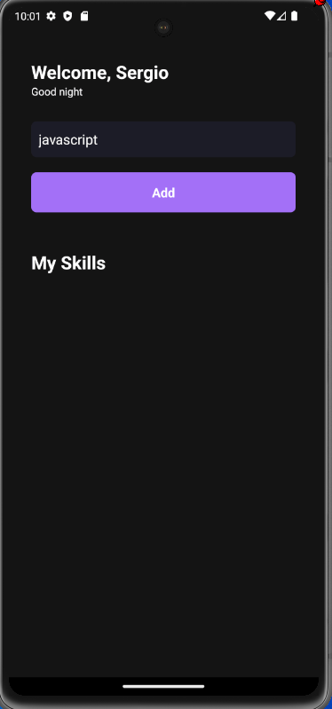
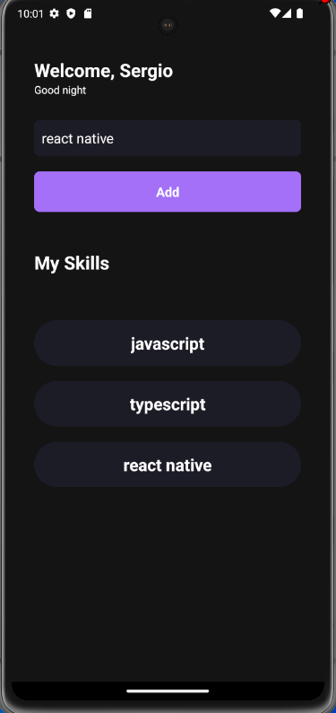

# My Skill 

Projeto com react native onde add minha skill.
Nesse projeto pode conhecer passa a passo a criacao de um projeto react native,
como iniciar, como criar componentes e como utilizar typecript, useState, useEffect, interface

